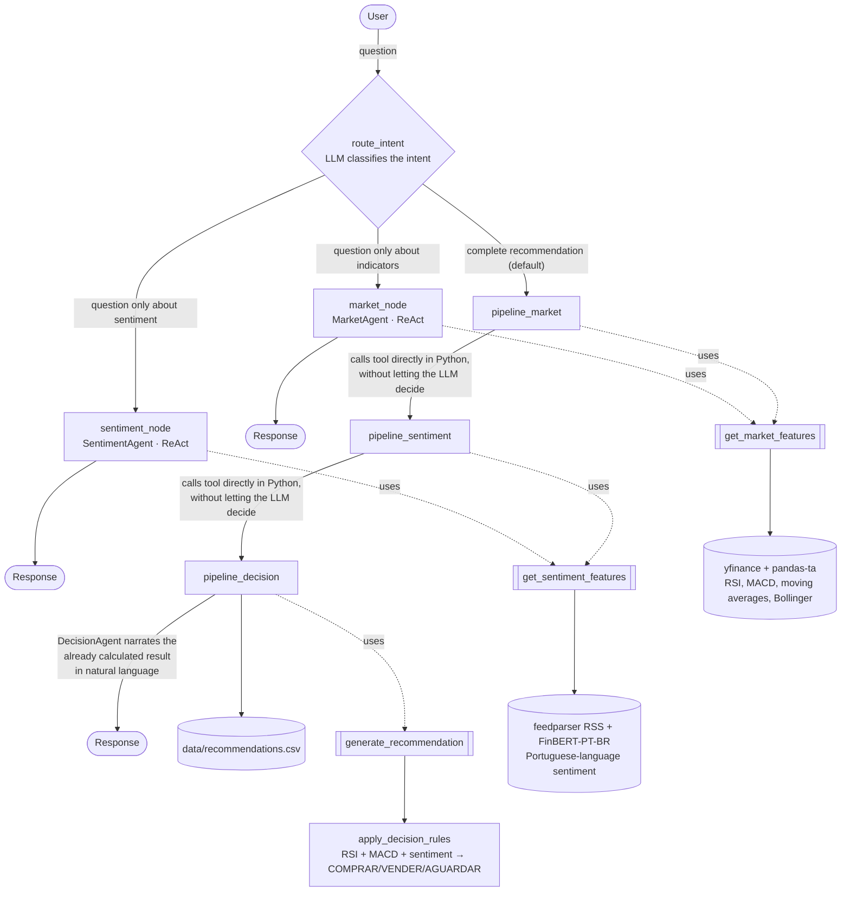
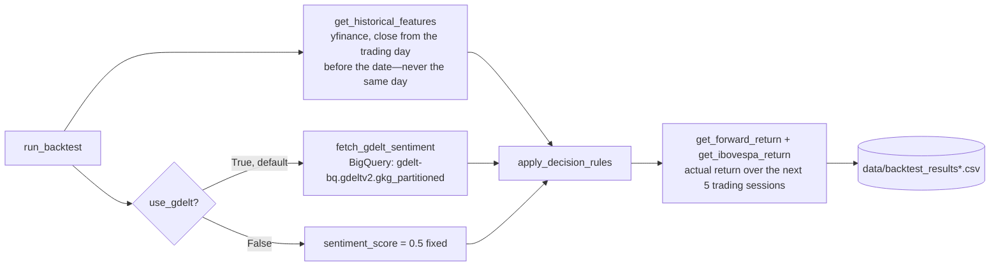

# Architecture

Two independent parts: the **real-time agent** (LangGraph orchestrator behind the Gradio interface) and the **historical backtest** (a pure Python script without an LLM). They share the same technical indicators and decision logic (`apply_decision_rules`), but they run separately—the backtest never calls the agent, and the agent never calls the backtest.

## Real-time agent

The orchestrator routes each question to one of 3 destinations, depending on the intent classified by the LLM. A complete recommendation follows a **fixed pipeline** (tools called directly in Python, without the LLM deciding whether or when to call them); specific questions use **true ReAct** (the LLM decides which tools to call).

**Why hybrid:** the fixed pipeline ensures that a complete recommendation never fails because the LLM "forgets" to call a tool or hallucinates a result without real data—this happened during development (see `docs/progress.md`) when the 3 steps were chained as ReAct agents passing along the accumulated conversation. Dynamic routing for specific questions does not carry this risk (it receives only the original question, with no accumulated history), so it can use true ReAct.

## Historical backtest

It runs outside the orchestrator, without an LLM or FinBERT, and uses only the pure decision function, iterating through each trading day in chronological order (never shuffled, to avoid introducing look-ahead bias).

**Why no LLM:** a natural-language narrative adds no value when run hundreds of times in a historical loop—the purpose of the backtest is to measure signal quality (RSI + MACD + sentiment), not explanation quality.

The decisions and trade-offs behind each choice above (deterministic pipeline, migration to BigQuery, protection against look-ahead bias) are detailed in [`decisions.md`](decisions.md).
